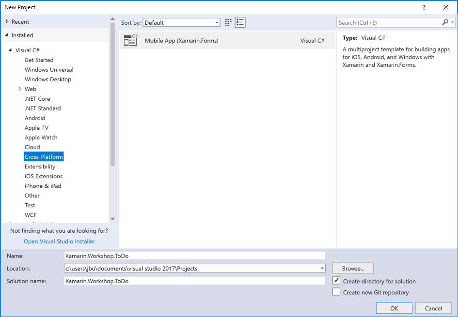
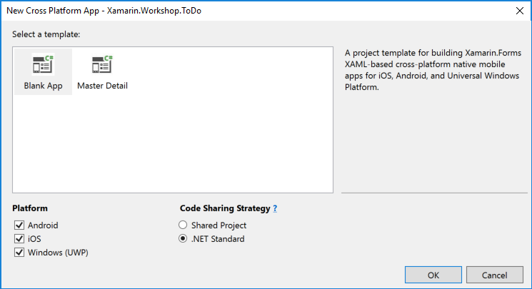
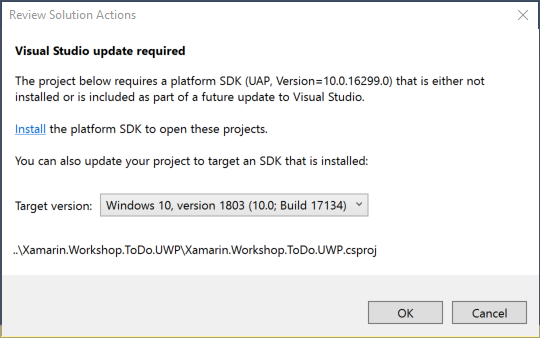

# Create Todo App project

## Take a look at the Xamarin Tools in Visual Studio
- Android SDK Manager
- Android Device Manager

## Create Xamarin.Forms project

## Look at the project structure
- .NET standard library (MainPage.xaml, App.xaml.cs)
- Android (MainActivity)
- iOS (Main.cs, AppDelegate.cs)
- UWP (MainPage.xaml, App.xml)

## Run the application
- Run on emulator (Android)
- Run on phone
- Use Xamarin Live Player
- Run on Windows (UWP)