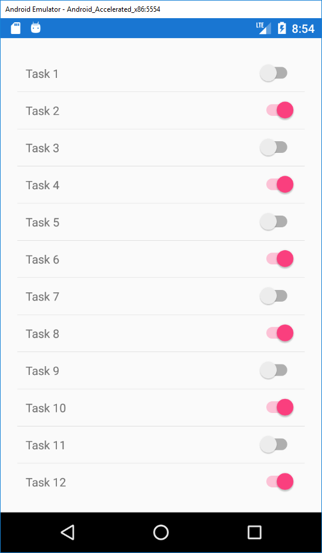

# First data binding with ListView 

- Use ListView instead of hard-coded items
- Add Data Binding to the list and the todo items
- Fill the list with 20 items and check if scrolling works

## More information:
- [ListView](https://docs.microsoft.com/en-us/xamarin/xamarin-forms/user-interface/listview/)
- [Data Binding](https://docs.microsoft.com/en-us/xamarin/xamarin-forms/app-fundamentals/data-binding/)