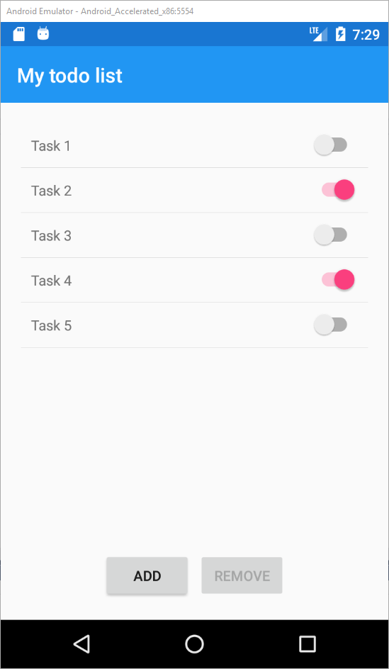
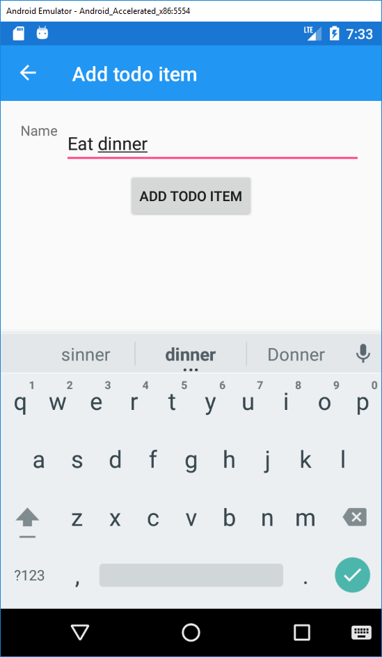

# Implement MVVM pattern

- Add a add and remove button to the list
- The add button show a new AddTodoItemPage (Use NavigationPage to navigate to the page) 
- The delete button should only be enabled when a todo item is selected
- Use commands and bind it to the buttons
- Store the todo items in a separate service
- Use dependency injection to register and resolve the service in the different ViewModels to avoid dependencies between the ViewModels
- Use the MessageCenter to send loosely coupled notifications to the ViewModels (instead of normal events)