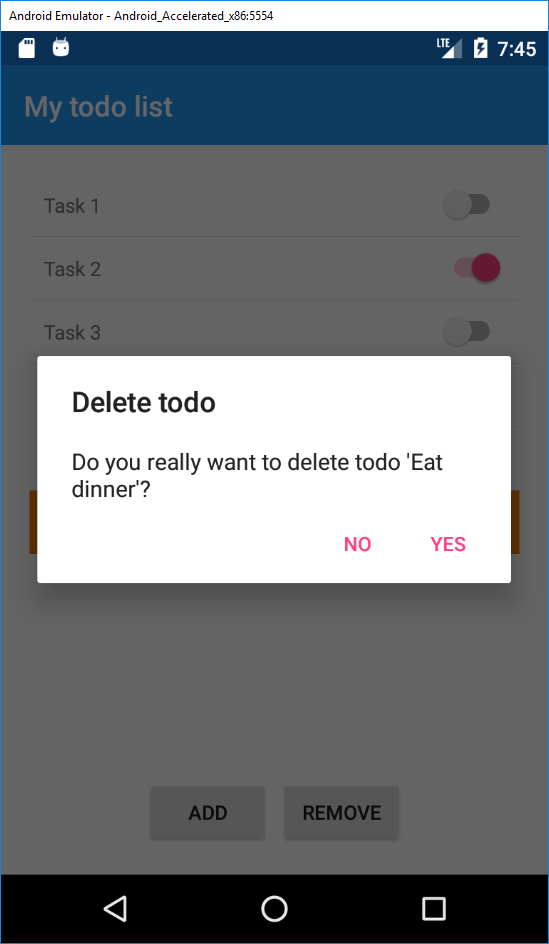

# Use MVVM framework
- Use [FreshMvvm](https://github.com/rid00z/FreshMvvm)
- Replace ViewModels with FreshMvvm PageModels (Use [AddINotifyPropertyChangedInterface] and get rid of view dependencies in ViewModel)
- Use FreshMvvm dependency injection with constructor injection
- Add DisplayAlert when deleting todo

## More information:
- [FreshMvvm](https://github.com/rid00z/FreshMvvm)
- [Fody PropertyChanged](https://github.com/Fody/PropertyChanged)